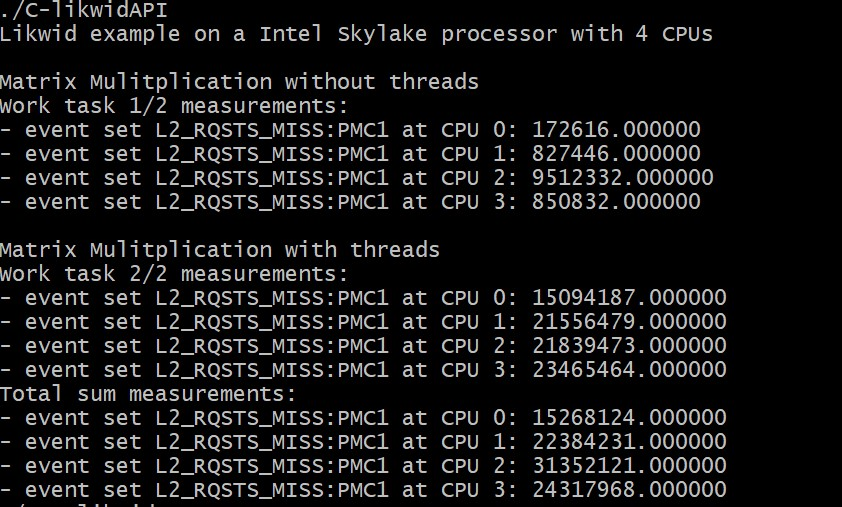

# Performance Analysis of Matrix Mulitiplication program using LIKWID APIs

## L3 CACHE MISSES ANALYSIS

- 

## ENERGY ANALYSIS
- 

## L2 CACHE MISSES RATE ANALYSIS
- 

## INSTRUCTION RETIRED ANALYSIS
- 

