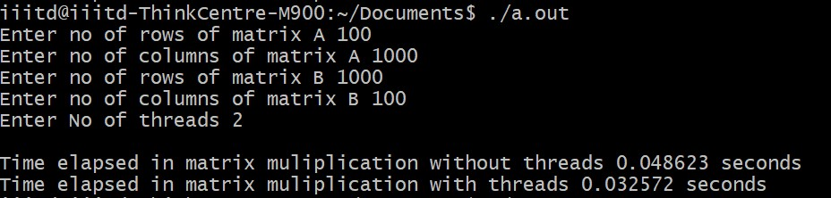
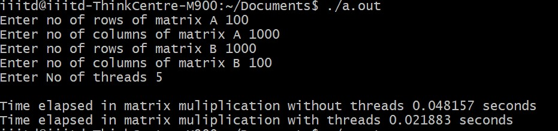
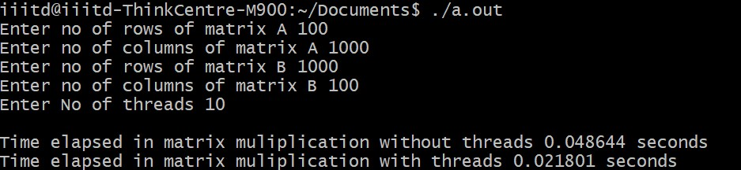

# Matrix mulitplication with openMP
## Results

## Dimension of A = 1000 * 100
## Dimension of B = 100 * 1000

### thread = 1
- 

### thread = 2
- 

### thread = 5
- 

### thread = 10
- 

### thread = 15
- 

## Dimension of A = 100 * 1000
## Dimension of B = 1000 * 100

### thread = 2
- 

### thread = 5
- 

### thread = 10
- 

